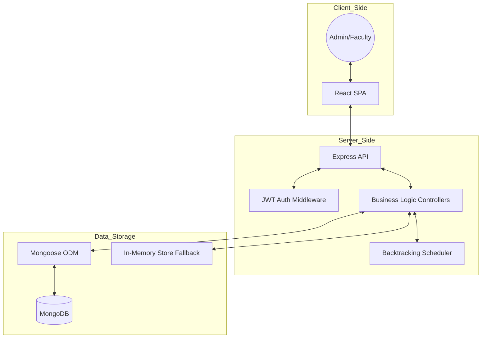

# Optima: Smart University Resource Scheduling System

Optima is a comprehensive university resource management and automated timetable generation system. It uses an intelligent backtracking algorithm to solve the complex constraint satisfaction problem of scheduling classes, faculty, and rooms without conflicts.

##  Setup Instructions

### Prerequisites
- Node.js (v14 or higher)
- npm or yarn
- MongoDB (local or Atlas)

### Backend Setup
1. Navigate to the backend directory:
   ```bash
   cd backend
   ```
2. Install dependencies:
   ```bash
   npm install
   ```
3. Configure environment variables:
   - Copy `.env.example` to `.env`
   - Update `MONGODB_URI` with your connection string
   - Set a strong `JWT_SECRET`
4. Start the server:
   ```bash
   # Development mode
   npm run dev
   
   # Production mode
   npm start
   ```

### Frontend Setup
1. Navigate to the frontend directory:
   ```bash
   cd frontend
   ```
2. Install dependencies:
   ```bash
   npm install
   ```
3. Configure environment variables:
   - Copy `.env.example` to `.env`
   - Ensure `REACT_APP_API_URL` matches your backend URL (default: http://localhost:5000/api)
4. Start the application:
   ```bash
   npm start
   ```

##  AI Planning & Algorithm

The core of Optima is its Backtracking-based Constraint Satisfaction Problem (CSP) Solver.

### Core Logic
The scheduler treats timetable generation as a search problem where it needs to assign values (Time, Faculty, Room) to variables (Class-Subject Slots) while satisfying a set of constraints.

1. Variables: Every hour of every subject required by every class.
2. Domain: All possible combinations of (Day, Period, Faculty, Room).
3. Constraints:
   - Faculty Conflict: A faculty member cannot be in two places at once.
   - Room Conflict: A room cannot host two different classes simultaneously.
   - Class Conflict: A class cannot attend two different subjects at the same time.
   - Availability: Assignments must honor faculty-defined availability windows.
   - Resource Matching: Lab subjects must be assigned to Lab rooms.
   - Continuity: Lab sessions are scheduled in consecutive periods (e.g., a 2-hour block).

### Search Strategy
- Uses Backtracking Search: If a partial assignment leads to a conflict, the algorithm "backtracks" and tries a different path.
- Randomization: Valid assignments are shuffled to ensure that repeated generations produce varied but valid results.
- Complexity Management: Includes safety limits (max attempts, max backtracks, and timeout) to ensure the system remains responsive even with highly constrained data.

##  Architecture Diagram



## Assumptions Made

1. Time Structure: The system assumes a 6-day work week (Monday-Saturday) with 8 periods per day.
2. Subject Competency: Faculty can only teach subjects they are specifically marked as competent in.
3. Room Types: Rooms are strictly categorized into 'Classroom' and 'Lab'.
4. Lab Blocks: Labs are assumed to require consecutive periods in the same room with the same faculty.
5. Departmental Silos: Classes generally take subjects within their department and semester, though manual overrides are supported.
6. Persistence: The system prioritizes MongoDB but includes a fully functional in-memory store for environments where a database connection is unavailable.

## Tech Stack
- **Frontend**: React, Vanilla CSS (Modern SaaS Dashboard design), React Router, Axios.
- **Backend**: Node.js, Express.js.
- **Database**: MongoDB with Mongoose ODM.
- **Security**: JWT Authentication, Bcrypt password hashing, Role-based access control.
- **Scheduling**: Custom JavaScript implementation of a Backtracking algorithm.
